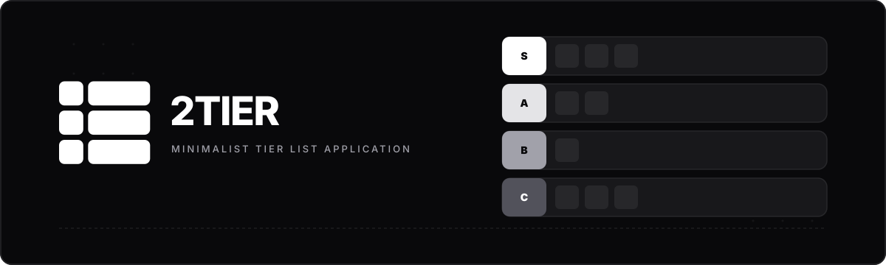

<p align="center">
  
</p>

<h1 align="center">2TIER</h1>

<p align="center">
  <strong>Minimalist, Open-Source Tier List Application for Web & Desktop</strong>
</p>

<p align="center">
  <a href="https://github.com/emireln/2tier/blob/main/LICENSE"></a>
  <a href="https://github.com/emireln/2tier"></a>
  <a href="https://github.com/emireln/2tier"></a>
  <a href="https://github.com/emireln/2tier"></a>
  <a href="https://github.com/emireln/2tier"></a>
</p>

---

## ✨ Highlights & Key Features

- ⚡ **Unified Drag & Drop Workspace**: Smooth, uninterrupted drag-and-drop powered by `@dnd-kit` across tier rows and unassigned item pools.
- 🎨 **Animated Lucide Icons**: Integrated official animated micro-interactions from [`lucide-animated.com`](https://lucide-animated.com/) and interactive SVG logo.
- 🌍 **Automatic Device i18n Detection**: Auto-detects user system language with support for **English (`en`)** and **Português do Brasil (`pt-BR`)**.
- 🖥️ **Electron Desktop Features**:
  - Auto-launch with Windows (`openAtLogin`).
  - Always-on-Top floating window toggle.
  - Native System Tray integration with double-click restore.
  - Frameless custom titlebar.
- 📸 **High-Resolution Image Export**: Render crisp un-scrolled PNG/JPEG images up to 4x Ultra HD resolution (`html-to-image`).
- ☯️ **Monochrome Design System**: Sleek black, gray, and white dark/light mode aesthetic built with Vanilla CSS variables and Tailwind CSS.
- 💾 **Local Collection & Templates**: Save tier list projects locally (`localStorage`) and create reusable custom templates.

---

## 🛠️ Technology Stack

- **Framework**: React 18 + Vite 5 + TypeScript
- **Desktop Runtime**: Electron 32
- **State Management**: Zustand (with local persistence)
- **Drag & Drop**: `@dnd-kit/core` & `@dnd-kit/sortable`
- **Animations**: Framer Motion (`motion/react`)
- **Icons**: Official Lucide Animated Icons + Lucide React
- **Exporting**: `html-to-image`

---

## 🚀 Getting Started

### Prerequisites

- [Node.js](https://nodejs.org/) (v18 or higher)
- `npm` or `pnpm`

### Installation

1. Clone the repository:
   ```bash
   git clone https://github.com/emireln/2tier.git
   cd 2tier
   ```

2. Install dependencies:
   ```bash
   npm install
   ```

3. Run in Web Development mode:
   ```bash
   npm run dev
   ```
   Open `http://localhost:5173` in your browser.

4. Run in Desktop Electron mode:
   ```bash
   npm run electron:dev
   ```

---

## 📦 Building & Packaging

- **Build Web App SPA**:
  ```bash
  npm run build
  ```

- **Package Desktop Executable (Windows/macOS/Linux)**:
  ```bash
  npm run electron:build
  ```

---

## 📁 Repository Structure

```
2tier/
├── electron/              # Electron main process & preload scripts
├── public/                # Favicon, icons, flag SVGs, and banner assets
│   ├── flags/             # br.svg and us.svg flag vector icons
│   ├── favicon.ico        # Multi-size white favicon
│   ├── icon.png           # High-res desktop app icon
│   └── tray-icon.png      # High-res white tray icon
├── scripts/               # Icon asset generation scripts
├── src/
│   ├── components/        # React UI components & animated icons
│   │   ├── icons/         # Official lucide-animated icon definitions
│   │   └── ...            # Titlebar, TierBoard, ItemPool, Drawers
│   ├── lib/               # i18n dictionaries & utility helpers
│   ├── store/             # Zustand state management
│   ├── types/             # TypeScript data contracts
│   └── App.tsx            # Main workspace & unified DndContext provider
└── package.json
```

---

## 📄 License

Distributed under the Apache License, Version 2.0. See `LICENSE` for more information.

---

<p align="center">
  Developed with ❤️ for tier list creators. Open-source on <a href="https://github.com/emireln/2tier">GitHub</a>.
</p>
